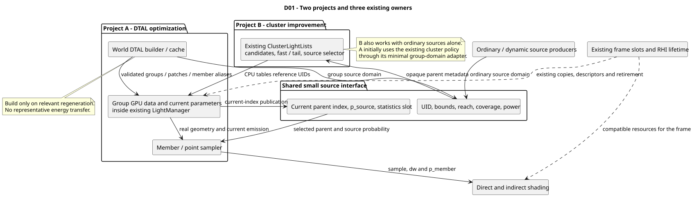
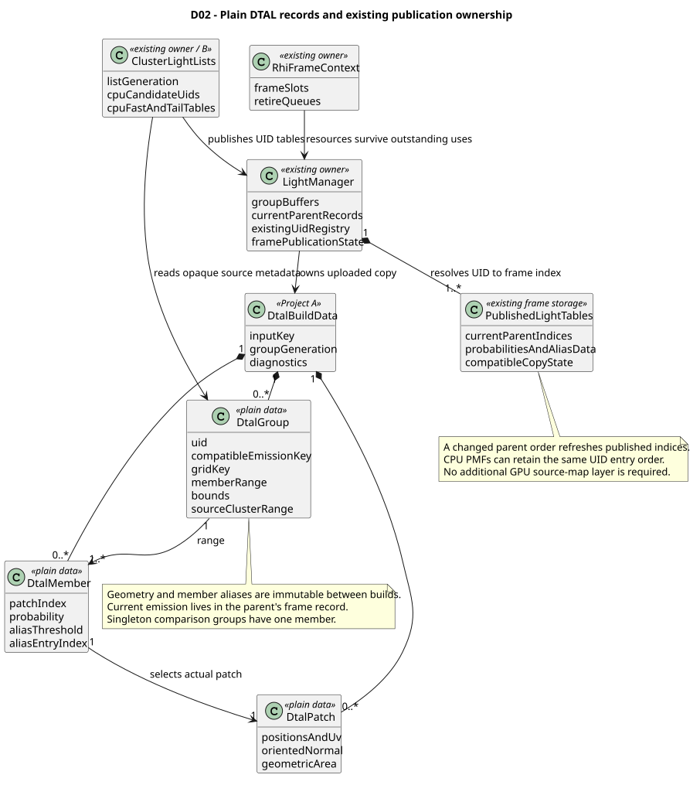
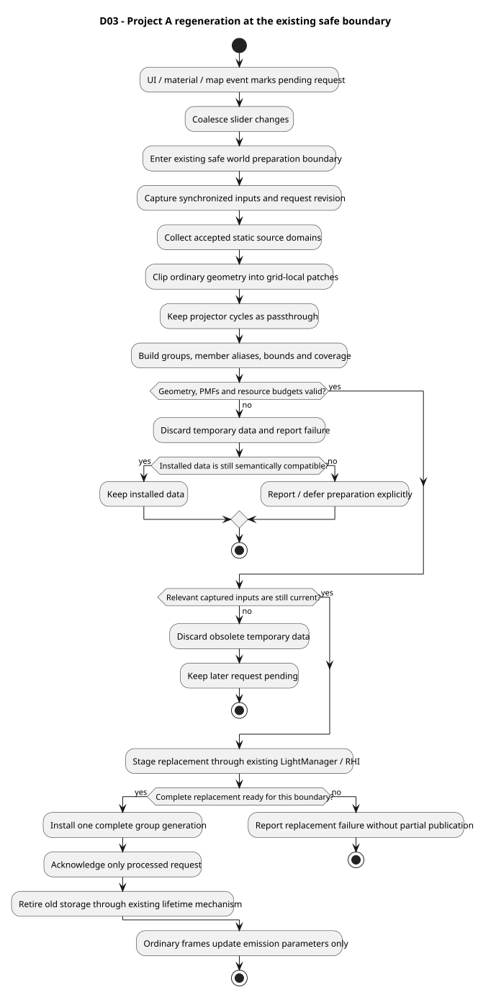
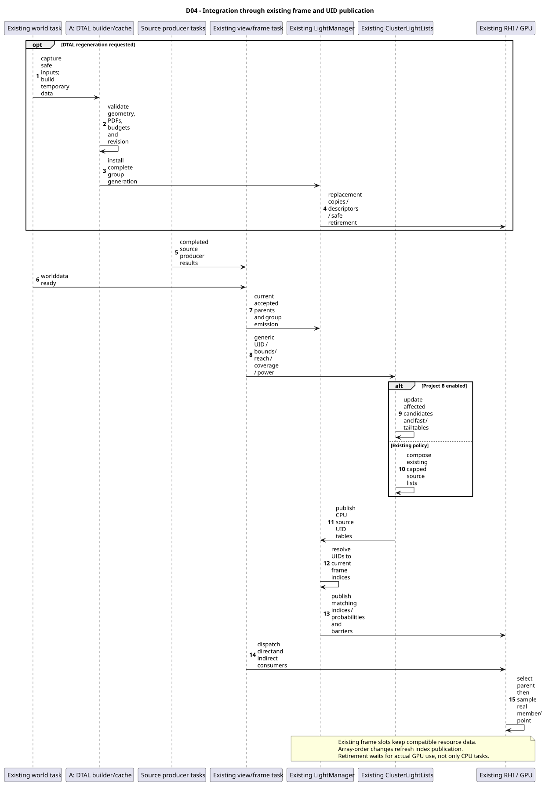
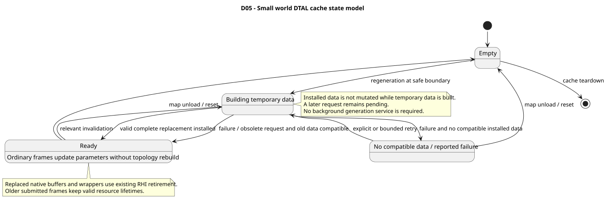
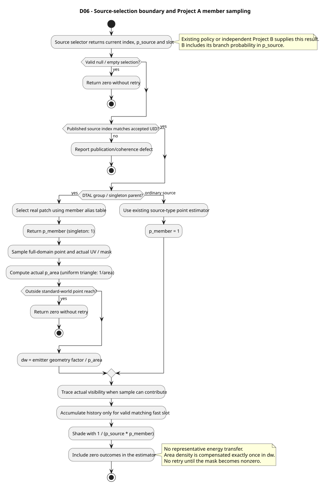
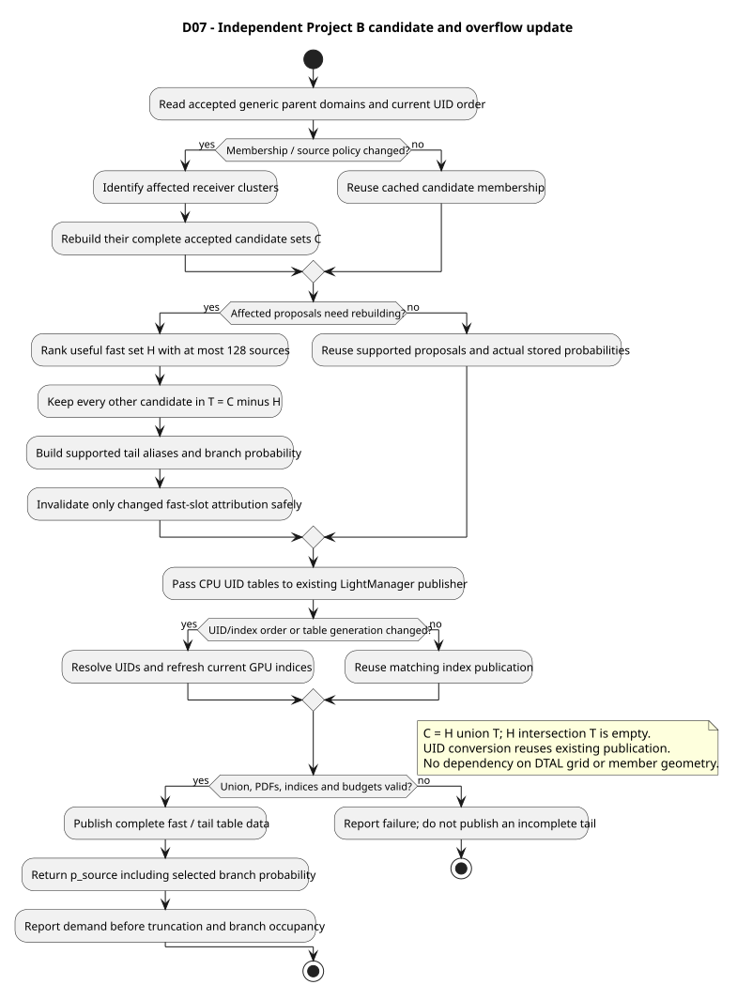

# UML: Two Independent Lighting Projects

## 1. How to use these views

The [roadmap](dtal-cluster-optimization-plan.md) separates **[A: DTAL optimization](dtal-optimization-spec.md)** from **[B: cluster selection](cluster-lighting-spec.md)**. These UML diagrams explain that separation and the small shared interface.

The target has three owners: the world DTAL builder/cache, existing `LightManager`, and existing `ClusterLightLists`. Existing frame slots and RHI code provide lifetime/synchronization. Seven diagrams are seven views of those owners, not seven new runtime systems.

PlantUML sources and locally rendered SVGs are under `docs/diagrams/dtal/`. Diagrams describe proposed implementation. Rendering proves syntax, not numerical lighting correctness.

## D01. Project boundary



[Source](diagrams/dtal/d01-components.puml)

A generates geometry/groups and samples real members. B selects opaque parent sources. Bounds, reach, coverage and power cross the boundary; UVs and member aliases do not. A initially integrates through the existing cluster policy with a minimal source-domain adapter, while B can be tested using ordinary sources alone.

Review: can A be accepted without capacity/ranking/overflow changes, and can B be accepted without the DTAL builder?

## D02. DTAL data and existing publication



[Source](diagrams/dtal/d02-data-model.puml)

Groups, members and patches are plain owned data. Current group emission lives in frame parent records. CPU cluster tables keep UID identity and the existing publisher converts UIDs to current indices for GPU access.

Review: each patch belongs to one active group; aliases reference the correct entries; current array reorder never selects another UID. No second stable-handle registry or GPU remapping layer is prescribed.

## D03. Synchronous regeneration



[Source](diagrams/dtal/d03-regeneration.puml)

Build temporary data at the existing safe boundary, validate, then install it through current owners. Callback events only request work. Keep later requests pending, preserve only compatible old data on failure, and avoid unbounded automatic retries.

Review: failed or obsolete builds do not publish partial geometry; a support-changing material edit cannot reuse incompatible clipped geometry. Ordinary animation never enters this activity.

## D04. Existing frame interaction



[Source](diagrams/dtal/d04-frame-sequence.puml)

Producer completion precedes source acceptance and publication. The composer uses either the old policy or B's fast/tail policy. `LightManager` performs existing UID-to-index conversion; RHI copies/barriers precede direct/indirect consumers. Replaced storage remains alive for its actual GPU use.

Review: CPU task synchronization alone does not release GPU resources. Index/table publication must update when parent array order changes, even if PMFs remain valid.

## D05. Small cache state model



[Source](diagrams/dtal/d05-snapshot-lifecycle.puml)

This is the cache's state, not a separate asynchronously managed generation service. Building uses temporary arrays; installed data is unchanged until a complete replacement is ready. Existing RHI retirement handles old submitted resource uses outside this logical cache state.

Review: failure with a compatible old build returns to Ready; failure without compatible data is explicit. An invalidation cannot overwrite old data while it is still being consumed.

## D06. Sampling contract



[Source](diagrams/dtal/d06-sampling.puml)

The parent selector returns `p_source`. A supplies `p_member` and `p_area`; ordinary sources use `p_member=1`. `dw` compensates area density once, and the caller compensates `p_source*p_member` once.

`p_joint = p_source * p_member * p_area`.

For positive support over the intended domain:

`E[estimate] = sum_i integral_patch_i p_joint * F_i / p_joint dA = sum_i integral_patch_i F_i dA`.

This proves the mean-preserving organization, not low variance. Mask estimates, grouping and ranking can affect variance without changing the mean if their actual selection probabilities are used.

Black, occluded, out-of-reach and valid null-stratum outcomes remain zero without retry. A published index resolving to another UID is a coherence error, not a valid black sample.

### Worked example of independent probability factors

With B enabled, let `beta=0.25`, fast probabilities for A/B be 0.4/0.6, and C be the only overflow source. Complete source probabilities are 0.30, 0.45 and 0.25; they sum to one.

If parent A contains patches with areas 2 and 8, area-weighted member probabilities are 0.2 and 0.8. Joint source/member probabilities are 0.06 and 0.24. Multiplying by area densities 1/2 and 1/8 gives the same density, 0.03 per unit area, on both patches.

A's tests can supply complete source selection directly. B's tests can use ordinary sources with `p_member=1`. Combined tests check the product. Empty fast strata add zero-contribution null outcomes; do not renormalize them away only in tests.

## D07. Cluster improvement



[Source](diagrams/dtal/d07-cluster-update.puml)

For each receiving cluster, `C=H union T`, `H intersection T=empty`, and `size(H)<=128`. Rebuild distributions for affected clusters initially; keep unaffected data cached. CPU tables retain UID identity and existing publication refreshes indices when required.

Review: source eviction from H moves it to T, not out of C; removal can refill fast slots; array reorder changes publication, not light identity. Coverage/eligibility is generic source metadata and does not inspect DTAL members.

## 2. Review and test matrix

| Contract | Project/view | Required witness |
|---|---|---|
| Exact emitting geometry and masks | A / D02-D03-D06 | Same admitted domain under singleton/grouped sampling |
| All selection factors | A and B / D06-D07 | PMF normalization and reference mean, separately and combined |
| Independent delivery | Shared / D01 | A with old cluster policy; B with ordinary lights |
| Stable source identity | B / D02-D04-D07 | Cached table publication after parent-array reorder |
| No lost invalidation | A / D03-D05 | Later request arriving while temporary build is processed |
| Safe compatible material/resource state | A / D03-D04-D05 | Support-changing reload and GPU work in flight |
| Group-independent reach | A evaluator, B broad phase / D06-D07 | Reach boundary intersecting a group at several spacings |
| Complete cluster support | B / D07 | 129/512/2048 accepted ordinary sources compared with reference |
| Safe slot history | B / D04-D07 | Rank exchange while previous frames still write history |
| No steady topology rebuild | A / D03-D05 | Animation-only/camera-only generation/upload counters |

## 3. Local validation and rendering

Use local Java and PlantUML paths, from the repository root:

```powershell
$Java = 'C:\path\to\java.exe'
$PlantUmlJar = 'C:\path\to\plantuml.jar'
& $Java -jar $PlantUmlJar -charset UTF-8 -checkonly -failfast2 'docs\diagrams\dtal\*.puml'
& $Java -jar $PlantUmlJar -charset UTF-8 -tsvg -nometadata -failfast2 'docs\diagrams\dtal\*.puml'
```

Keep SVGs synchronized with the sources. Component/class/state views use embedded Smetana layout. Rendering has been checked with PlantUML 1.2026.8 and local OpenJDK; this is diagram tooling evidence, not proof that runtime optimizations are implemented.
