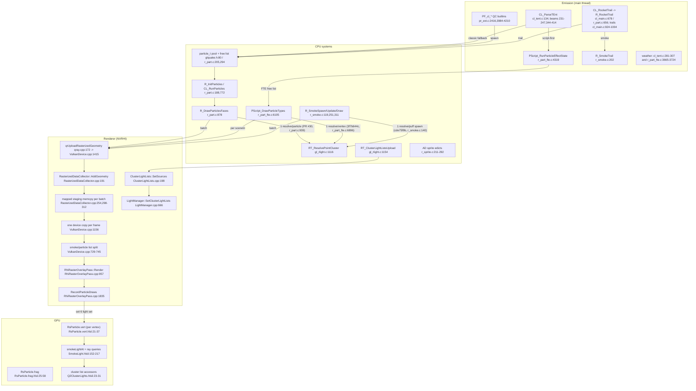
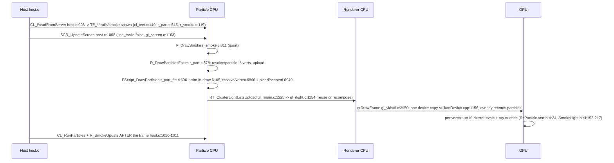

# Particle rendering — the current architecture

Planning draft, corrected after an external review and a verification round. Pinned to commit
`ae589e04` (branch `perf/particle-cluster-cache`). All anchors below are valid at that commit; the
working tree additionally carries an uncommitted 512x4 point-cluster cache in `Quake/gl_rlight.c`
(not part of the committed tree, no counters, untested).

## 1. Component view

## 2. One frame (main thread vs GPU)

## 3. Pipeline data

| Step | Where | Cost/limits | Anchor |
|---|---|---|---|
| Classic pool | CPU | `MAX_PARTICLES 16384` default; `-particles` can raise it without an upper clamp; `particle_t` 48 B | r_part.c:30-35,188-205; glquake.h:80-91 |
| Classic geometry | CPU main | 3 `QrVertex` (80 B) per particle = 240 B; one resolve per particle | r_part.c:57,917-919,939 |
| FTE pool | CPU main | 262144 compiled, `r_part_maxparticles 65536` default; beams 2048 segments; decals 262144 compiled / 8192 default | r_part_fte.c:457-459,497-498 |
| FTE geometry | CPU main | geometry varies: line sparks 2 verts, fan/clipped decals 3, billboards 4 (`r_part_fte.c:5615-5715,5859,6016-6102`); one resolve per vertex | r_part_fte.c:6070-6087,6895-6896 |
| FTE conversion | CPU main | early-out when no live scenetri or empty buffers (`6828-6832`); otherwise copies the grow-only capacity arrays `cl_maxstrisvert`/`cl_maxstrisidx` | r_part_fte.c:6838-6857 |
| Smoke | CPU main | 1024 puffs, 6 verts per puff (480 B), resolve once at spawn | r_smoke.c:25,140,328 |
| Resolve | CPU main | `RT_ResolvePointCluster` -> `RT_ResolveLightLeaf`: 1 `Mod_PointInLeaf` + up to 18 probes at 2/8/24 u, else cluster 0 | gl_rlight.c:1088-1114,1116 |
| Upload | CPU main | per-batch memcpy to mapped staging; one device copy per frame of accumulated totals; collector caps 262144 verts / 524288 idx; assert (Debug) or silent batch drop (Release) on overflow | RasterizedDataCollector.cpp:221-231,254,298-312; VulkanDevice.cpp:1156 |
| Lighting lists | CPU main | per-cluster lists, `Q2_MAX_CLUSTERS 8192`; reuse or incremental/recompose; `listGeneration` ticks per composition | ClusterLightLists.cpp:198,790; LightManager.cpp:666; ShaderCommonC.h:181 |
| GPU shading | GPU | per vertex: <=16 candidate evals (`SMOKE_CLUSTER_SCAN 16`) + ray queries; no particle GPU pass timer | SmokeLight.hlsli:59,152-217; qray.cpp:368-389 |
| AD sprites | CPU main | QC-created sprite edicts bypass the particle pools but use the same raster overlay; `part_max=max(particlemax,1024)*multiplier` | part_generate.qc:224-230,780-804; r_sprite.c:245-291 |

Frame model: `use_tasks` is forced false (gl_screen.c:1163-1164); classic and smoke simulate after
`SCR_UpdateScreen` (host.c:1008-1011); FTE simulates inside its draw (r_part_fte.c:6105).

## 4. Architectural flaws (facts, not proposals)

1. Light-cluster resolves are CPU BSP walks on the main thread: classic added by PR #30
   (r_part.c:939), FTE by `3f7b644c` (r_part_fte.c:6896), smoke earlier by `cde75f9b`
   (r_smoke.c:140). The uncommitted work-tree cache changes this only when enabled and hit.
2. No threading anywhere in the path (use_tasks false).
3. FTE scratch is capacity-sized and grow-only: conversion is skipped when nothing is live, but
   when it runs it walks the grown capacity, not the live counts (r_part_fte.c:6838-6857).
4. Full re-upload of all particle vertices every frame (240 B/classic particle, 320 B + 24 B indices
   per FTE billboard, 480 B per smoke puff).
5. Shader lighting per vertex: 3x (classic) / 4x (FTE billboard) redundant cluster scans and rays.
6. Silent failure modes: classic stops spawning at pool exhaustion; the raster collector asserts in
   Debug and drops batches in Release (RasterizedDataCollector.cpp:221-231).
7. One-frame simulation lag for classic and smoke; FTE sim inside the draw.
8. No live counters in dumps (`rs_particles` computed at r_part.c:985, never dumped), no FTE/smoke
   counts, no overflow counters.

## 5. Measured data (corrected)

- `cpu.particles_ms` in the CSV is the maximum of each ~0.2 s window (gl_vidsdl.c:463-466,561-562,
  1208-1215), not a per-frame mean. Oct 7 dumps at the AD start spot: mean of window maxima
  **5.35/5.38 ms** (dumps 114328/114442, all rows), last 90 rows **6.82/6.87 ms**, p95 of window
  maxima **7.67/7.93 ms**. It must never be quoted as a frame-average particle cost.
- Owner observations not yet reproduced by an experiment: a 39.1 ms window maximum in the overlay,
  and `r_particles 0` raising fps 45→95 in one moment (frame time 22.22→10.53 ms, a ~11.7 ms
  improvement, not a proven 40 ms saving).
- Current `config.cfg` (mtime 2026-10-07 17:40): `r_particles 0`, but `r_fteparticles 1`,
  `r_particle_lighting 1`, `r_smoke 1`, `vid_vsync 2`, `host_maxfps 200` — only the classic path is
  off; every A/B must pin the rest.
- Map data (verified from the shipped paks and the loader): `maps/start.bsp` raw leaf lump 7308,
  **world visleafs 6125 -> identity mapping, 6126 clusters**; `maps/ad_tfuma.bsp` raw 24232,
  **visleafs 18806 -> grid 23x23x15 = 7935 cells + reserved 0 = 7936 clusters** (the loader reads
  `visleafs` into `mod->numleafs`, gl_model.c:2376,2598; the world cluster count uses
  `submodels[0].visleafs`, r_world.c:1919,1961).
- Protocol anchors: `CL_ParseParticles` cl_parse.c:1621-1665; `svcdp_trailparticles`/`pointparticles`/
  `pointparticles1` 2047-2061 (the earlier 2711-2740 anchor does not exist).

## 6. Evidence manifest (to be captured before stages)

Per measurement: commit hash and branch, exact config (pinned copy, not the live `config.cfg`), BSP
and pak hashes, GPU/driver, internal render resolution, demo name/hash, and the capture interval
used for any statistic. Dumps and `benchmark.log` are stored under `perf/` scenarios with the build
hash; none of today's dumps carry any of this, which is why Stage 0 exists.
