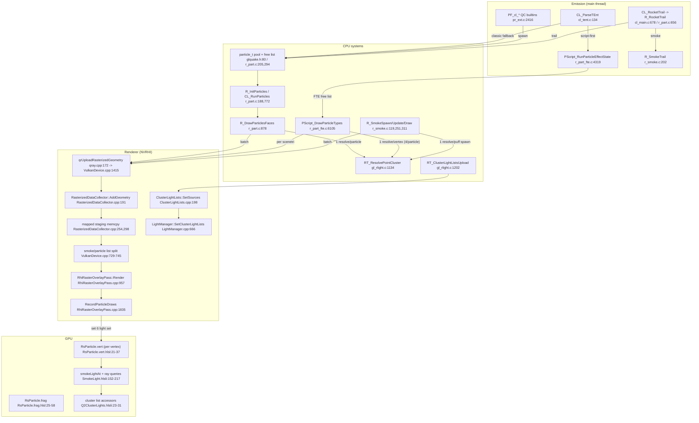
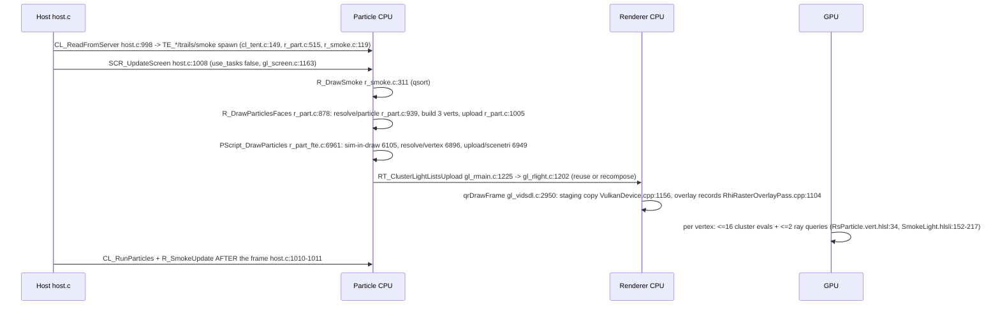

# Particle rendering — the current architecture

Planning draft. Pinned to branch `perf/particle-cluster-cache` at `99d8eaad` (master `d2346126`
plus local changes: the present-wait removal, the `gl_heap.c` zero-size scratch fix, and an
uncommitted 512x4 point-cluster cache in `Quake/gl_rlight.c`). Every current-engine claim below
carries a repo-relative anchor valid at that pin.

## 1. Component view

## 2. One frame (main thread vs GPU)

## 3. Pipeline data

| Step | Where | Cost/limits | Anchor |
|---|---|---|---|
| Classic pool | CPU | `MAX_PARTICLES 16384`; `particle_t` 48 B; drop on overflow | r_part.c:30-35; glquake.h:80-91 |
| Classic geometry | CPU main | 3 `QrVertex` (80 B) per particle = 240 B; 1 resolve/particle | r_part.c:57,917-919,939 |
| FTE pool | CPU main | `MAX_PARTICLES 262144` compiled, `r_part_maxparticles 65536`; beams 2048; decals 262144 | r_part_fte.c:457-459,497 |
| FTE geometry | CPU main | 4 verts/particle, 1 resolve/vertex = 4 resolves + <=8 vertex rays; convert over full capacity each frame | r_part_fte.c:6070-6087,6895-6896,6843-6857 |
| Smoke | CPU main | 1024 puffs, 6 verts, resolve once at spawn | r_smoke.c:25,140 |
| Resolve | CPU main | `RT_ResolvePointCluster` -> `RT_ResolveLightLeaf`: 1 `Mod_PointInLeaf` + up to 18 probes | gl_rlight.c:1088-1114,1134-1171 |
| Upload | CPU main | scratch memset per request; one staging memcpy + device copy per batch; collector caps 262144 verts / 524288 idx, assert+drop on overflow | gl_heap.c:112-116; RasterizedDataCollector.cpp:221-231; gl_vidsdl.c:2202-2203 |
| Lighting lists | CPU main | per-cluster lists, `Q2_MAX_CLUSTERS 8192`, reused or recomposed | ClusterLightLists.cpp:198; LightManager.cpp:666; ShaderCommonC.h:181 |
| GPU shading | GPU | per vertex: <=16 candidate evals (`SMOKE_CLUSTER_SCAN 16`) + <=2 ray queries; no particle GPU pass timer | SmokeLight.hlsli:59,152-217; qray.cpp:368-389 |

Frame model: `use_tasks` is forced false (gl_screen.c:1163-1164); classic and smoke simulate after
`SCR_UpdateScreen` (host.c:1008-1011), FTE simulates inside its draw (r_part_fte.c:6105).

## 4. Architectural flaws (facts, not proposals)

1. Every light-cluster resolve is a CPU BSP walk on the main thread, per classic particle and per
   FTE vertex; PR #30 introduced it (r_part.c:939, r_part_fte.c:6896, r_smoke.c:140).
2. No threading anywhere in the path (use_tasks false).
3. FTE scratch is capacity-sized and grow-only: once any particle exists, `cl_maxstrisvert` never
   returns to zero (r_part_fte.c:6831), so every frame memsets/converts the full capacity
   (r_part_fte.c:6843-6857).
4. Full re-upload of all particles as vertex data every frame; 240 B/particle before memset and
   staging copies.
5. Shader lighting runs per vertex, not per particle: 3x (classic) to 4x (FTE) redundant cluster
   scans and ray queries.
6. Silent failure modes: classic stops spawning on pool exhaustion (r_part.c:272), the raster
   collector asserts in Debug and drops batches in Release (RasterizedDataCollector.cpp:221-231).
7. One-frame simulation lag for classic and smoke; FTE sim inside the draw.
8. Hard caps and no live counters: `rs_particles` is computed (r_part.c:985) but never dumped;
   dropped/overflown counts are invisible.

## 5. Measured data appendix (what we actually know)

- Recorded dumps on AD `start` (Oct 7, `build\Debug\ad\stats-*.dump`): `cpu.particles` means
  4.7-7.4 ms at 46-55 fps; one owner screenshot shows a 39.1 ms window maximum.
- Owner A/B at the spot: `r_particles 0` raised fps 45→95 in that moment (classic+FTE heads are
  gated together; r_part.c:886, r_part_fte.c:6983).
- The 40 ms figure is a window maximum, not a mean; the dumps do not reproduce the 45→95 delta, so
  the plan's first stage is measurement, not a fix.
- Current `config.cfg` carries `r_particles 0`, `r_fteparticles 0`, `r_particle_lighting 0`,
  `vid_vsync 2`, `host_maxfps 200` — every A/B must pin and restore these.
- Map data: installed `start.bsp` = 7308 leafs -> identity mapping, 7309 clusters; `ad_tfuma.bsp`
  = 24232 leafs -> 23x23x15 grid = 7936 clusters. The "18806 leafs" figure matches neither.
