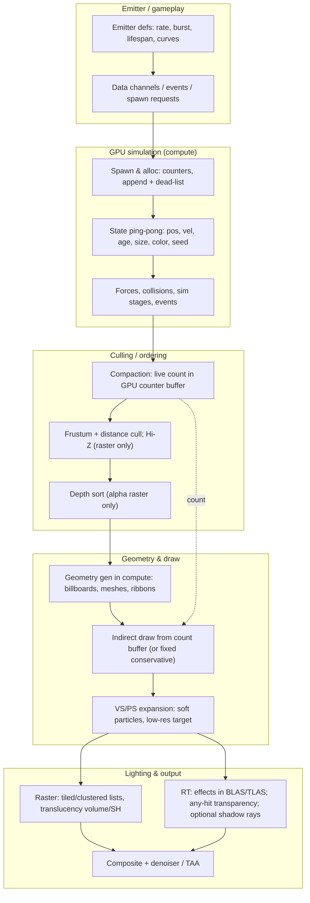

# Particle rendering — modern reference architecture

Planning draft, corrected after the external review and a web-source verification round (2026-10-07). Claims are sourced; vendor marketing is marked; unsourced estimates are labelled as such.

## 1. Unified modern GPU-particle architecture

The diagram mixes three pipelines (raster draw, compute geometry, RT AS path) that real engines pick
per effect;

## 2. What the reference engines actually do

| Engine | Simulation | Geometry / draw | Lighting | Source |
|---|---|---|---|---|
| Unreal Engine 5 Niagara | CPU or GPU compute, sim stages; data channels inject gameplay events into shared Niagara systems (Epic 5.5 notes); CPU emitter/system overhead exists alongside GPU sim | GPU instance-count buffer feeds indirect draws with no synchronous CPU readback (async readback only, multi-frame latency); sprite/mesh/ribbon renderers; GPU sort/cull tasks run when threshold-gated CVars enable them (sorting off by default — `Niagara.GPUSorting.CPUToGPUThreshold` default -1) | Lumen provides lower-quality GI for Lit Translucency and Volumetric Fog (Epic 5.8); RT Translucency was available through 5.4 (not deprecated — NVIDIA 5.4 guideline), UE 5.6 deprecated the legacy method (renamed "Legacy Ray Tracing") and added a new "Ray Traced" translucency method | Epic: Lumen GI and Reflections docs (5.8); Measuring Performance in Niagara, Niagara Debugger, Niagara CVar reference (5.8); FNiagaraGPUInstanceCountManager API; NVIDIA UE5.4 RT guide; UE 5.6 release notes |
| id Tech 7 / 8 | Part GPU simulation (compute), depth-based collision, per-particle-system resolution control; part runs a per-thread command bytecode (Coenen: "a bytecode machine written in a shader") | Decoupled particle lighting: two 2048² atlases (lighting + dominant direction), inherited from id Tech 6; software-raster light/decal culling with compute hexahedra; id Tech 8 uses OMM to skip shading fully transparent/opaque pixels on alpha-tested geometry (NVIDIA lists particles only as a generic OMM workload example) | DOOM Eternal received RT reflections + DLSS in the **2021-06-29** update (not at launch); DOOM: The Dark Ages (id Tech 8) path tracing uses SHaRC + SER | Coenen's DOOM Eternal study; NVIDIA Eternal RT news (2021-06-29); NVIDIA Dark Ages path-tracing news (SHaRC/SER); NVIDIA id Tech 8 developer interview (OMM/SER) |
| Q2RTX / vkpt | CPU legacy Quake sim, effects uploaded per frame | CPU-built quads (particles, sprites), instanced explosion triangles and procedural-cylinder beams in a separate effects TLAS; any-hit transparency; beams become real lights (cylindrical area lights via `vkpt_build_beam_lights`) | NEE shadow rays traverse the geometry TLAS with mask `AS_FLAG_OPAQUE` (`SHADOW_RAY_CULL_MASK`) and never the separate effects TLAS, so particles do not occlude NEE; effects appear on primary/reflection/GI rays (GI skips procedural beams); transparency uses a min/max distance accumulator (packed nearest/farthest distances + premultiplied color, fog blended into gaps; unordered ray-query hits, no sorted list — path_tracer_transparency.glsl:60-87, pin f2526e9a) | NVIDIA Q2RTX sources, pin `f2526e9a` (master HEAD, 2025-12-11): path_tracer_rgen.h:66,483-492; path_tracer_transparency.glsl:60-87; path_tracer.c:904-922,937; transparency.c:555 |
| RTX Remix | Compute spawn -> evolve -> generate; per-material systems; particle count default **10000 per material is a runtime option, not a compiled cap** (rtx_particle_system.h:190; UI range 1-10,000,000, rtx_particle_system.cpp:208) | Compute-built billboards (4 verts, 8 with motion trail), AS-build-input usage; fixed buffers with a conservative draw count and a **delayed CPU readback** of the counter through a 10-frame mappable ring, no synchronous GPU wait (rtx_particle_system.cpp:118-174, 861-862, 969) | Generated geometry enters the scene AS; NVIDIA release notes/news claim accurate shadows and reflections (vendor claim, no independent benchmark); the source shows indirect/reflection resolve is approximate (rtx_options.h:220,231,709-712) | dxvk-remix pin `e4e7303` (main); RTX Remix particle docs/changelog (release 1.2, 2025-09-09) |
| Generic GPU pattern | Ping-pong state + append/dead-list compaction; command-based sim | VS billboard expansion; indirect count; bitonic sort for alpha; Hi-Z cull; soft particles | Cluster/light-grid or SH ambient; per-particle shadow rays only in path tracers | GPU Gems 2 ch. 46; GPU Gems 3 ch. 23; GDC 2014 compute particles; SIGGRAPH 2015 GPU-driven pipelines |

## 3. Essential vs optional

- Essential: GPU-side spawn/allocation counters; fixed-capacity state with compaction; parallel
  geometry generation; no synchronous CPU readback of counts; emitter-level culling; content events.
- Optional: bitonic sort (alpha raster only), Hi-Z occlusion (raster concept), indirect draw
  (fixed conservative draws are acceptable, cf. Remix), mesh/Nanite particles, per-particle lights,
  sim stages, data channels.

## 4. What does NOT transfer to a path-traced Quake at 4K/165 Hz

- Per-particle shadow/NEE rays at 1M: the 3-6M-rays figure is an order-of-magnitude estimate, not a
  measurement (treat as unsourced until Stage 0). Q2RTX excludes particles from NEE shadow rays
  entirely; Remix puts them in the scene AS (vendor-claimed shadowing) while its indirect/reflection
  resolve is approximate. Budget rays per frame, not per particle.
- Raster-first machinery: indirect + sort + Hi-Z assume a raster target; in a path tracer, effects
  must enter an effects TLAS (any-hit) or be composited; sorting is wasted work for additive.
- The claim that per-frame particle BLAS rebuild is the main cost of 100k demos is an **unsupported
  estimate** until measured; keep it as a risk, not a fact.
- OMM and mesh particles depend on hardware features that must be verified for this renderer.

## 5. End-state scope in this engine (reconciled with the plan)

- GPU simulation is planned for the **classic** path only (Stage 5); FTE/PSET simulation, spawn-side
  dlights and sounds stay CPU-authoritative (D6). The unified diagram therefore does not describe a
  plan to move every particle to the GPU.
- What stays CPU: PSET scripts and `effectinfo` content, FTE emitters that spawn dlights
  (r_part_fte.c:3888-3934), weather spawns, trails/emitstate, classic Quake temp-entity semantics.

## 6. Source list (minimum)

1. Epic, Measuring Performance in Niagara (5.8); Niagara Debugger; Niagara CVar reference (`Niagara.GPUSorting.CPUToGPUThreshold`, `Niagara.GPUCulling.CPUToGPUThreshold`); `FNiagaraGPUInstanceCountManager` API.
2. Epic, Lumen Global Illumination and Reflections (5.8: "lower-quality global illumination for Lit Translucency"); UE 5.6 release notes (legacy RT translucency deprecated, "Ray Traced" method); NVIDIA UE5.4 ray-tracing guideline.
3. Simon Coenen, DOOM Eternal graphics study (particles: per-thread command-bytecode sim; two 2048² lighting atlases; software-raster light/decal culling).
4. NVIDIA, DOOM Eternal RT + DLSS update (2021-06-29); Dark Ages path-tracing news, SHaRC/SER (geforce news, June 2025); id Tech 8 developer interview, OMM/SER (Sep 2025).
5. NVIDIA Q2RTX sources, pin `f2526e9a` (master HEAD, 2025-12-11): `path_tracer_rgen.h:66,483-492`, `path_tracer_transparency.glsl:60-87`, `path_tracer.c:904-922,937`, `transparency.c:555`.
6. dxvk-remix sources, pin `e4e7303` (main): `rtx_particle_system.h:190`, `rtx_particle_system.cpp:118-174,208,861-862,969`, `rtx_options.h:220,231,709-712`; RTX Remix particle how-to and release notes 1.2 (2025-09-09).
7. GPU Gems 2 ch. 46 (sorting), GPU Gems 3 ch. 23 (off-screen particles), GDC 2014 compute particles,
   SIGGRAPH 2015 GPU-driven rendering pipelines.
