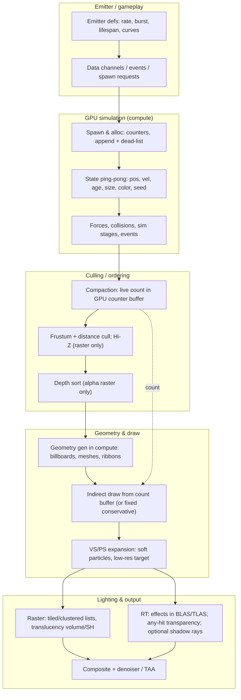

# Particle rendering — modern reference architecture

Planning draft. Claims are sourced; vendor marketing is marked. This document answers "how do
modern optimized engines do particles", and states what transfers to a path-traced Quake and what
does not.

## 1. Unified modern GPU-particle architecture

## 2. What the reference engines actually do

| Engine | Simulation | Geometry / draw | RT lighting | Source |
|---|---|---|---|---|
| Unreal Engine 5 Niagara | CPU or GPU compute, sim stages; data channels merge bursts | GPU instance-count buffer, no CPU readback; sprite/mesh/ribbon renderers; GPU sort/cull tasks when enabled | Translucency lit traditionally (volume SH-like, forward shading), not Lumen GI; Ray Traced Translucency deprecated | Epic docs: Niagara scalability/measuring, data channels; NVIDIA UE5.4 RT guide |
| id Tech 7/8 | Compute-shader sim, depth-based collision, per-emitter quality; command-bytecode style sim | Decoupled particle lighting atlas (2x2048^2), software-raster light/decal culling; id Tech 8 uses OMM for alpha-tested particles | RT reflections/GI at launch; path tracing with SHaRC + SER; DOOM Eternal RT reflections can miss particles | Coenen's DOOM Eternal study; NVIDIA id Tech 8 interview |
| Q2RTX / vkpt | CPU legacy Quake sim, effects uploaded per frame | CPU-built quads/spheres into a separate effects TLAS; any-hit transparency with distance-ordered blending; beams become real lights | Shadow rays traverse the opaque TLAS only (`SHADOW_RAY_CULL_MASK`), so particles do not occlude; explosions emit into GI rays | NVIDIA Q2RTX shaders (particle/sprit/explosion/beam any-hit, TLAS_INDEX_EFFECTS) |
| RTX Remix | Compute spawn -> evolve -> generate geometry; per-material systems; default cap 10000 particles/material | Compute-built billboards (4 verts, 8 with motion trail) with AS-build-input usage; conservative count; no CPU readback | Generated geometry is part of scene BLAS, so path-traced; vendor claims shadows/reflections (marketing: "tens of thousands", demo 100k, code cap 10k) | RTX Remix particle docs + dxvk-remix particle sources/changelog |
| Generic GPU pattern | Ping-pong state + append/dead-list compaction; command-based sim | VS billboard expansion; indirect count; bitonic sort for alpha; Hi-Z cull; soft particles | Cluster/light-grid or SH ambient; per-particle shadow rays only in path tracers | GPU Gems 2 ch. 46; GPU Gems 3 ch. 23; GDC 2014 compute particles; SIGGRAPH 2015 GPU-driven pipelines |

## 3. Essential vs optional

- Essential: GPU-side spawn/allocation counters; fixed-capacity state with compaction; parallel
  geometry generation; no CPU readback of counts; emitter-level culling; content events.
- Optional: bitonic sort (only for alpha raster; unnecessary for additive), Hi-Z occlusion
  (raster-only concept), indirect draw (fixed conservative draws are acceptable, cf. Remix),
  mesh/Nanite particles, per-particle lights, sim stages, data channels.

## 4. What does NOT transfer to a path-traced Quake at 4K/165 Hz

- Per-particle shadow/NEE rays at 1M: 3-6M rays rival the entire primary budget; Q2RTX excludes
  particles from shadow rays and Remix approximates them. Budget rays per frame, not per particle.
- Raster-first machinery: indirect + sort + Hi-Z assume a raster target; in a path tracer effects
  must enter an effects TLAS (any-hit) or be composited; sorting is wasted work for additive.
- Per-frame particle BLAS rebuild is the real cost of 100k-particle demos; cap accordingly.
- OMM and mesh particles depend on hardware features that must be verified for this renderer.
- Data channels/sim stages are disproportionate for sprite-based Quake content.

## 5. What stays CPU in this engine (for parity and content reasons)

PSET scripts and `effectinfo` content, FTE emitters that spawn dlights (r_part_fte.c:3888-3911),
weather scripts, and classic Quake temp-entity semantics. The GPU owns simulation/geometry/lighting
of particles, not gameplay logic.
