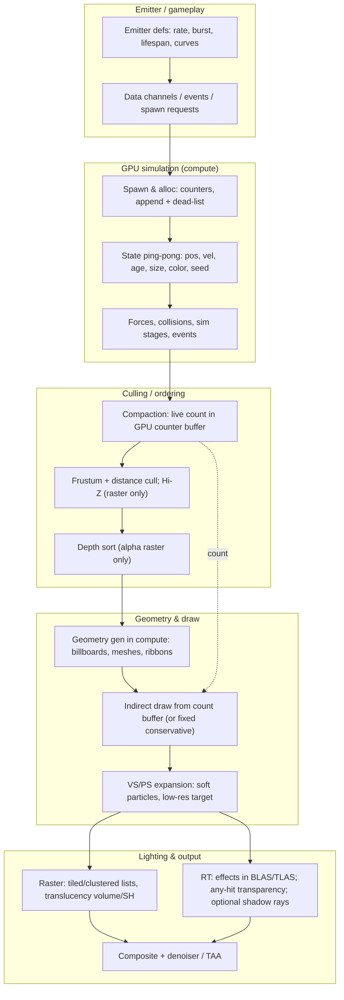

# Particle rendering — modern reference architecture

Planning draft, corrected after the external review. Claims are sourced; vendor marketing is marked.
Items marked "verify before use" need a version-pinned source before the document is published.

## 1. Unified modern GPU-particle architecture

The diagram mixes three pipelines (raster draw, compute geometry, RT AS path) that real engines pick
per effect;

## 2. What the reference engines actually do

| Engine | Simulation | Geometry / draw | Lighting | Source (verify before publication where marked) |
|---|---|---|---|---|
| Unreal Engine 5 Niagara | CPU or GPU compute, sim stages; data channels merge bursts; CPU emitter/system overhead exists alongside GPU sim | GPU instance-count buffer without synchronous CPU readback; sprite/mesh/ribbon renderers; GPU sort/cull tasks when enabled | Lit Translucency is supported by Lumen at lower quality (not "no GI"); Ray Traced Translucency status is version-dependent — the UE5.4 RT guide still lists it as available (verify the target release before claiming deprecation) | Epic: Niagara scalability/measuring/data channels; Lumen GI docs; NVIDIA UE5.4 RT guide |
| id Tech 7 / 8 | Compute-shader sim, depth-based collision, per-emitter quality; command-bytecode style sim | Decoupled particle lighting atlas (2x2048^2), software-raster light/decal culling; id Tech 8 uses OMM for alpha-tested particles | DOOM Eternal received RT reflections in the **2021-06-29** update (not at launch); DOOM: The Dark Ages (id Tech 8) path tracing uses SHaRC + SER | Coenen's DOOM Eternal study; NVIDIA Eternal RT news (2021-06-29); NVIDIA id Tech 8 interview |
| Q2RTX / vkpt | CPU legacy Quake sim, effects uploaded per frame | CPU-built quads/spheres into a separate effects TLAS; any-hit transparency; beams become real lights | Shadow rays traverse the opaque TLAS only (`SHADOW_RAY_CULL_MASK`), so particles do not occlude; transparency uses a min/max distance accumulator blend (path_tracer_transparency.glsl:60-86, pin f2526e9a), not a full sort | NVIDIA Q2RTX sources (path_tracer_rgen.h:66; path_tracer_transparency.glsl:60-86) |
| RTX Remix | Compute spawn -> evolve -> generate; per-material systems; particle count default **10000 per material is a configurable budget, not a compiled cap** (UI allows more) | Compute-built billboards (4 verts, 8 with motion trail), AS-build-input usage; fixed buffers with a conservative count and a **delayed CPU readback** of the counter (no synchronous GPU wait) | Generated geometry enters the scene BLAS; vendor claims shadows/reflections (marketing) | dxvk-remix rtx_particle_system.cpp (~118-162 readback, ~208 budget); RTX Remix particle docs/changelog |
| Generic GPU pattern | Ping-pong state + append/dead-list compaction; command-based sim | VS billboard expansion; indirect count; bitonic sort for alpha; Hi-Z cull; soft particles | Cluster/light-grid or SH ambient; per-particle shadow rays only in path tracers | GPU Gems 2 ch. 46; GPU Gems 3 ch. 23; GDC 2014 compute particles; SIGGRAPH 2015 GPU-driven pipelines |

## 3. Essential vs optional

- Essential: GPU-side spawn/allocation counters; fixed-capacity state with compaction; parallel
  geometry generation; no synchronous CPU readback of counts; emitter-level culling; content events.
- Optional: bitonic sort (alpha raster only), Hi-Z occlusion (raster concept), indirect draw
  (fixed conservative draws are acceptable, cf. Remix), mesh/Nanite particles, per-particle lights,
  sim stages, data channels.

## 4. What does NOT transfer to a path-traced Quake at 4K/165 Hz

- Per-particle shadow/NEE rays at 1M: 3-6M rays rival the whole primary budget; Q2RTX excludes
  particles from shadow rays; Remix approximates them. Budget rays per frame, not per particle.
- Raster-first machinery: indirect + sort + Hi-Z assume a raster target; in a path tracer, effects
  must enter an effects TLAS (any-hit) or be composited; sorting is wasted work for additive.
- The claim that per-frame particle BLAS rebuild is the main cost of 100k demos is an **unsupported
  estimate** until measured; keep it as a risk, not a fact.
- OMM and mesh particles depend on hardware features that must be verified for this renderer.

## 5. End-state scope in this engine (reconciled with the plan)

- GPU simulation is planned for the **classic** path only (Stage 5); FTE/PSET simulation, spawn-side
  dlights and sounds stay CPU-authoritative (D6). The unified diagram therefore does not describe a
  plan to move every particle to the GPU.
- What stays CPU: PSET scripts and `effectinfo` content, FTE emitters that spawn dlights
  (r_part_fte.c:3888-3934), weather spawns, trails/emitstate, classic Quake temp-entity semantics.

## 6. Source list (minimum)

1. Epic, Niagara scalability and best practices; measuring performance in Niagara; data channels.
2. Epic, Lit Translucency; Lumen GI documentation; NVIDIA UE5.4 ray-tracing guideline.
3. Simon Coenen, DOOM Eternal graphics study (particles: compute-command sim, 2x2048^2 atlases).
4. NVIDIA, DOOM Eternal RT + DLSS update (2021-06-29); id Tech 8 path tracing (SHaRC/SER) blog.
5. NVIDIA Q2RTX sources, pin `f2526e9a`: `path_tracer_rgen.h:66`, `path_tracer_transparency.glsl:60-86`.
6. dxvk-remix sources and RTX Remix particle docs/changelog (configurable budget, delayed readback).
7. GPU Gems 2 ch. 46 (sorting), GPU Gems 3 ch. 23 (off-screen particles), GDC 2014 compute particles,
   SIGGRAPH 2015 GPU-driven rendering pipelines.
