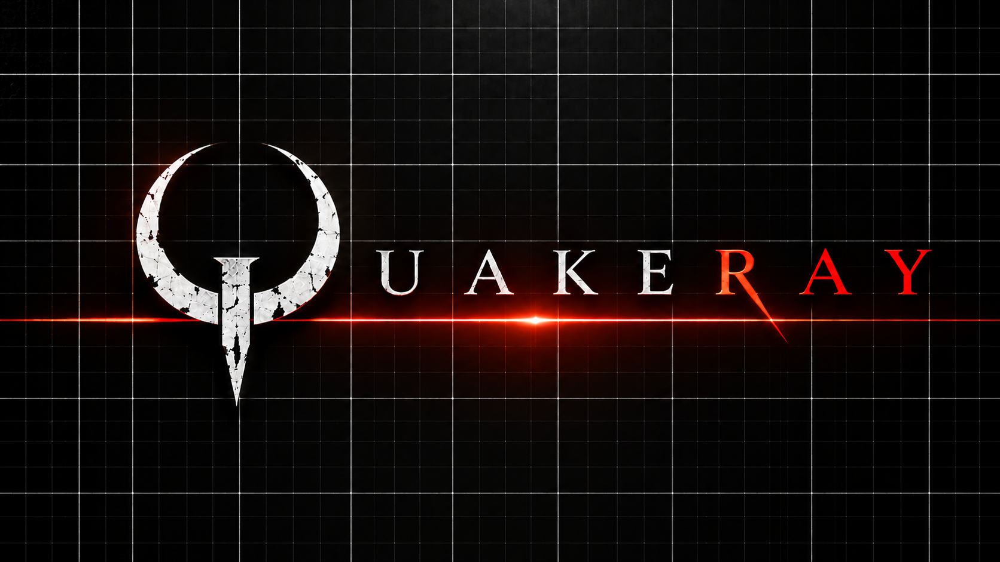

# QuakeRay engine

QuakeRay is a ray tracing engine for Quake 1 with Q2RTX-style partial path tracing, built on NVRHI and running on Vulkan.

## Features

### Path traced renderer

* Ray tracing with ReSTIR direct light sampling
* FSR 3.1 support
* DTAL (Dynamic Texture Area Lights) system: all emissive surfaces are sampled as textured area lights with a per-surface light, with its own intensity, blend mode, screen-color ceiling, sharp mask and mip boost knobs. A light reads the same emission mask the visible surface does, in the point it samples, so a face bright in its centre and dark around it lights the scene from its lit part alone — through the light styles and the animated frames as well.
* True Light Mode is enabled by default (`rt_truelight 1`): materials marked `is_light` cast light from their emission, with model DTAL limits independent of the BSP limits.
* Q2RTX-style path traced lighting.
* ASVGF denoiser.
* RT Global Illumination
* NEE (Next Event Estimation) for the sun, emissives and dynamic lights.
* Alpha-transparent textures are traced through, not only cut out: a material marked `alpha_test` hands its alpha to the sampler, and a ray that crosses such a texel keeps the strength of its transparency.
* Spot lights: a dynamic light can shine in a cone, with adjustable angles and strength (`dlightspot` at the console until the editor places them).
* per-BSP-cluster light lists (legacy).
* Animated light entities (`rt_light_styles`) make their own fixture flicker, in accordance with the original light style, to preserve the original Quake 1 lighting design.
* Full material system with per-brush and per-model metalness/roughness, normal map strength and texture-driven gloss maps, plus ray-traced water with animated wave normals and refraction.

### Lighting and Material Editor

The game is edited from inside it: `qr_editor` opens a dialog that offers the material editor or the light editor, and `qr_editor_stop` leaves either. Both fly over the frozen level; the crosshair picks what is edited, the fire button selects it, and Tab brings up the panel.

* **Material editor**: the material of the surface you are looking at — its textures, its glow, its gloss and metalness, and the light it casts. Every animation frame of a model or an animated texture is a block of its own. Select emissive colors with an eyedropper or draw polygon masks over the preview; focused and projected emission share the Emissive section. Save writes the session, and the exit question saves it permanently or discards it.
* **Light editor**: a selectable list of generated emitter lights, custom points or spotlights that can be added and cloned, and the level's lighting itself — the sky, the clouds, the sun, the god rays and the fog. Emitter styles can be overridden, and spotlight gizmos provide continuous Y/Z rotation and direction-aligned horizontal movement. A torch lights the way while a level has no light yet.
* **Editor reset**: the trash button beside the tabs clears the active mod's saved material or light work after confirmation and restores defaults, including the corresponding editor settings.

### Game data

* Quake game files are read from the local `id1` when present and from the Quake installation in the Steam library otherwise, file by file — game PAKs, the re-release music and the mods the Steam copy of the active mode carries included — without copying them next to the executable; the classic and the remastered modes are separate like in vkQuake, so the Steam `rerelease` PAKs, its add-ons and the Nightdive downloads belong to the remastered mode, a local file always wins, and the engine assets live in one `id1/qray.pkz`.

### Sound

* OpenAL Soft positional sound with the built-in MIT KEMAR HRTF and a graphical five-band equalizer; the engine opens no SDL audio device.

## Graphics

* Dynamic HDR Tone mapping: overall brightness, exposure bias in EV, contrast as a mix of the fixed and the auto-exposure adapted curve
* Procedural sky with volumetric clouds, configurable sky and sun colours, and cloud-shadowed sunlight
* God rays — volumetric sun shafts, aimed at the sun or at the bright areas of the sky texture
* Volumetric fog
* Bloom
* Post-processing: chromatic aberration, and a configurable LUT for colour grading
* Shader smoke — the trails of rockets, lava balls and grenades are drawn as soft, lit puffs the room's light falls on, in place of the classic flat sprites
* Enhanced models — a model that ships a `.md3` or `.md5mesh` beside its `.mdl` is drawn from it, with MD5 skinned from its `.md5anim` and skins resolved from the shader name; the Graphics menu's `Models` row picks enhanced or classic
* Adaptive vsync, VRR and FreeSync: `vid_vsync` picks the presentation mode (off, vsync, adaptive, FreeSync), adaptive by default

## Roadmap

* DirectX 12
* FSR 4, radiance cache
* DLSS
* UE5-style post effects
* Full path tracing
* Hybrid rasterization/RT
* Arcane Dimensions support
* Quake Remastered support
* More shader effects

## Definitions

* **ASVGF** - the renderer's temporal + a-trous denoiser, filtering each lighting channel apart
* **TAL** - Q2RTX's name for a light cut out of a surface: a face polygon sampling its emission mask
* **DTAL** - QuakeRay's TAL: any emissive surface is a light, moving models included

## Changelog

See [changelog.md](changelog.md).

## Build

The project is built with CMake and Ninja using the MSVC compiler from Visual Studio Build Tools.

### Windows

Prerequisites:

* [Git for Windows](https://github.com/git-for-windows/git/releases)
* [Visual Studio Build Tools](https://visualstudio.microsoft.com/downloads/) with the "Desktop development with C++" workload
* [CMake](https://cmake.org/download/) 3.20 or newer
* [Ninja](https://ninja-build.org/)
* [Vulkan SDK](https://vulkan.lunarg.com/sdk/home) (with `glslc` and `dxc`; the shaders are compiled from `renderer/Source/Shaders` - the HLSL twins with `dxc`, the remaining GLSL stages with `glslc`)
* GPU with ray tracing support

Steps:

1. Clone the repository:

   ```
   git clone --recursive https://github.com/sdas234f23f/QuakeRay.git
   ```

2. (Re)build the SPIR-V shaders - optional: `build_win.ps1` already builds and deploys them (see step 3), so you only need this when iterating on `renderer/Source/Shaders` on their own:

   ```
   .\build_shaders.ps1
   ```

   This compiles `renderer/Source/Shaders` (the HLSL twins with `dxc`, the remaining GLSL stages with `glslc`) and deploys the SPIR-V into `build\Debug\id1\shaders` (`-DestDir <dir>` to deploy somewhere else). Pass `-Rebuild` to ignore the shader cache and recompile everything, and `-GenCommon` when the generated shader-common headers changed.

3. Configure and build:

   ```
   .\build_win.ps1 Debug
   ```

   Debug builds go to `build\Debug` (the default build dir for the given configuration). Pass an explicit directory as a second argument only if you know you want a different one.

   (or with plain CMake: `cmake -B build\Debug -G Ninja -DCMAKE_BUILD_TYPE=Debug` + `cmake --build build\Debug`; use `-DCMAKE_BUILD_TYPE=Release` and `build\Release` for a release build - note that plain CMake only compiles the engine, while `build_win.ps1` is what stages the runtime assets: `qray.pkz`, `qray.materials.yaml` and the SPIR-V shaders. An engine built with plain CMake alone cannot start and fails with a missing blue-noise/shader error). If a fully parallel first build runs the compiler out of heap (`fatal error C1060`), cap the job count: `.\build_win.ps1 Release -Parallel 4`.

   The build then deploys the engine assets into `build\<Config>\id1`: `qray.pkz` carries the `renderer/Source/textures` (the QR material textures, model skins, luma and gloss maps), the SPIR-V shaders, the blue noise and water normal tables, the axe cursor artwork and the GUI font, while the material definitions (`renderer/Source/materials.yaml`) stay loose as `id1/qray.materials.yaml` because the editor rewrites that file.

4. Run the game:

   ```
   build\Debug\quakeray.exe
   ```

   `SDL2.dll`, `OpenAL32.dll` and all codec DLLs are copied next to `quakeray.exe` automatically during the build. The renderer is compiled into the executable - no external renderer DLL is needed. The `.spv` shaders and the blue noise texture are loaded from the game data (`id1/qray.pkz`).

5. (Optional) Package a release - needs a Release build (`.\build_win.ps1 Release`):

   ```
   .\bundle_release.ps1
   ```

   Writes `dist\QuakeRay-v<version>-win64.zip`: the Release `quakeray.exe`, the runtime DLLs, the `id1` engine assets (`qray.pkz` and the loose `qray.materials.yaml`), `readme.md`, `changelog.md`, `LICENSE.txt` and the third-party notices under `licenses/` (OpenAL Soft's LGPL text and the pffft licence). The version in the archive name is read from `ENGINE_VERSION` / `ENGINE_VER_PATCH` (`Quake\quakedef.h`) unless `-Version` passes one in; debug artifacts are never included, and the original game data is not bundled.

### Cloud renderer regression test

The optional GPU test runs without opening a game window or loading Quake data. It checks the six cubemap faces and mip chains, live cloud-quality changes, stationary-frame caching, wind and camera motion, cloud shadows at different heights, and the god-rays descriptor/push-constant interface. It also compares low with medium at three layer scales, reports GPU pass timings, checks sun-disc motion under fast clouds, and verifies disc-size scaling. It requires a Vulkan 1.3 GPU; Vulkan validation is enabled when the SDK's validation layer is available.

```
cmake -S . -B build/Debug -DQR_BUILD_TESTS=ON
.\build_win.ps1 -Config Debug
ctest --test-dir build/Debug -R qray_clouds_gpu --output-on-failure
```

## Ray tracing settings

Everything is exposed as console variables; run `cvarlist rt_` in the console for the full list. The ones that change the look most are:

* `rt_brightness 1.0` - overall brightness of the ray-traced image
* `rt_exposure_bias 0` - exposure in EV from -3 to +3, a power-of-two factor applied inside the tone curve
* `rt_contrast 0.6` - mixes the fixed tone curve with the auto-exposure adapted one (`0` keeps the fixed curve, `1` is the adapted curve alone)
* `rt_sky_sun 1` with `rt_sky_sun_pitch 140` / `rt_sky_sun_yaw 120` - the sun's intensity and direction: `0` turns it off, and the indirect sun and god rays scale with it
* `rt_sky_sun_color 255 255 255` - colour of the sun and its disc, independent of the sky, as `<r> <g> <b>` in `0-255`; commas and a bare query work, and it is archived
* `rt_sky_sun_size 1.0` - apparent sun-disc size multiplier, available in Lighting and the editor's Sun section: `0.5` halves its diameter, `2` doubles it, and `0` hides the disc while retaining sunlight. Range `0`-`10`; the default preserves the previous size
* `rt_sky_sun_edit 0` - mode: while it is `1` the sun follows the crosshair and writes `rt_sky_sun_pitch` / `rt_sky_sun_yaw`; the fire button leaves it without shooting, and it never survives a restart
* `rt_sky_godrays_intensity 1` with `rt_sky_godrays 1` - strength of the volumetric sun shafts and their on/off switch: `2` doubles them, `0` removes them and the shadow map they are marched through
* `rt_sky_godrays_sky_threshold 0.75` - luminance a sky area needs for the god rays to pull to it, as a mean over 16x16 cells of the skybox or of the scrolling sky; the rays aim at the centre of everything above it, and `0` keeps the brightest point alone
* `rt_sky 1`, `rt_sky_brightness 1.0`, `rt_physical_sky 1` - sky intensity and sky model
* `rt_physical_sun 0` - sunlight switch: `1` enables the sun and opens the editor's Sun section; `0` disables sunlight and lets the classic sky's bright areas drive god rays. Sun direction is controlled by `rt_sky_sun_pitch` / `rt_sky_sun_yaw`
* `rt_sky_color 255 255 255` - colour of the sky and the ambient light it casts, as `<r> <g> <b>` in `0-255`; commas, quotes and a bare query work, and it is archived
* `rt_sky_clouds_color 0 0 0` - colour the clouds are composited over the sky with, as `<r> <g> <b>` in `0-255`; commas and a bare query work
* `rt_sky_clouds_quality 2` with `rt_sky_clouds_height 140000` and `rt_sky_clouds_thickness 90000` - all four levels use volumetric clouds: `0` low (384-pixel faces, 32 march steps), `1` medium (512/40), `2` high (1024/48), `3` ultra (2048/56). Low keeps the same cloud shape, detail, scattering and sun occlusion, with a 512x512x8 shadow volume; medium/high use 1024x1024x8 and ultra uses 2048x2048x8. Height and thickness are world units above the camera. `rt_sky_clouds` switches the layer, and `rt_sky_clouds_alpha`, `_coverage`, `_density` and `_speed` control opacity, coverage, optical density and wind. Changes apply live; old quality `4` values are clamped to `3`
* `rt_sky_godrays_quality 2` - resolution of the shadow map the shafts are traced through, on its separate `0`-`4` ladder
* `rt_sky_ambient_lod 4` - mip level the ambient sky light is read from; lower is more directional, `10` is a flat wash
* `rt_sky_nee 1` - sample the sky as an explicit light; `0` restores the pre-NEE result
* `rt_gi_level 1` - indirect lighting: `0` off, `0.5` half-resolution, `1` one indirect bounce, `2` adds the diffuse second bounce; the menu cycles the same levels
* `rt_sky_sun_bounce_range 2000` - how far the sun reaches into an indirect bounce, in Quake units; `0` turns indirect sunlight off, and smaller is cheaper and dimmer
* `rt_sky_sun_bounce_scale 1.0` - multiplier on the sun's contribution to an indirect bounce; `1.0` is the physical value
* `rt_nee_samples 1` - next-event light samples per pixel in the direct pass: `1` or `2`, where `2` trades more shadow rays for a quieter image
* `rt_indir2bounces 0` - legacy switch for the second diffuse bounce, kept for old configs; `rt_gi_level` now selects it
* `rt_denoiser 1` - ASVGF reconstruction of the lighting channels (`0` composites the raw ReSTIR output)
* `rt_no_textures 0` - `1` swaps the diffuse albedo for a fixed value, i.e. "no textures"
* `rt_emis_light_intensity 1.0` - how much light the emissive (luma-masked) surfaces emit
* `emissive_focus` (material key in `qray.materials.yaml`) - half-angle in degrees of the cone a DTAL of that material shines in: full brightness inside it, nothing outside (`0` or no key keeps the default wide lobe); `emissive_focus_soft` (degrees, default a tenth of the angle) is the width of the soft edge, `0` making it nearly hard. With `emissive_projector` it is the projector's beam angle
* `emissive_projector` (material key in `qray.materials.yaml`) - the material's DTAL reads its mask along the direction it lights, so the pattern of a stained window or a sign is painted across the beam; the light stays the cone around the normal (`emissive_focus`, no key = `60`; `emissive_focus_soft` softens the cone edge in the cone mode and the projected pattern in the projector mode)
* `rt_dtal_minarea 0` / `rt_dtal_maxpolys 64` - the size floor (world units², `0` off) and the per-surface cap (`0` = no cuts) of the DTAL splits; `rt_dtal_rebuild` re-runs the collection
* `rt_dtal_clearance 1` - a DTAL polygon facing solid geometry within this many units is not created (`0` off)
* `rt_dtal_debug 0` - `1` draws the DTAL wireframes, `2` their normals as arrows
* `rt_light_color 255 255 255` - tint on every light source, as `<r> <g> <b>` in `0-255`; commas, quotes and a bare query work, and it is archived
* `rt_globallight 255 255 255` - colour a light starts from before its own colour and the tint above, as `<r> <g> <b>` in `0-255`; same forms, and `rt_globallight_mult` is the separate intensity
* `rt_light_styles 1` with `rt_light_styles_reach 48` - animated light entities flicker on their own fixture; the reach in Quake units keeps the flicker there, and `-1` removes the limit
* `rt_cluster_incremental 1` with `rt_cluster_dlights 1` - per-cluster light lists: `rt_cluster_incremental` is read-only (it rebuilds only the changed lights' slots), and `rt_cluster_dlights 0` keeps the moving emitters out of the lists while still traced and lit
* `rt_turb_warp 1` - amplitude of the classic texture warp on lava and teleport surfaces (`0` freezes them; water and slime use the RT water waves instead)
* `rt_teleport_portals 0` - off, so teleport surfaces render as ordinary surfaces; `1` re-enables the mirrored destination
* `rt_stats <level>` - the ImGui readout: `1` ray counters, `2` adds GPU pass timings, `3` adds the CPU profile; `0` hides it, a bare `rt_stats` prints the panels; every millisecond value carries a graph of the last twelve seconds, refreshed five times a second by default (`rt_stats_interval`, clamped to `0.05`-`0.2`), and the overlay scales with the screen resolution; archived
* `rt_stats_dump` - writes the current frame's readout to `qperfdump.log`, one `section name value` line per number; appended, on a separate thread
* `rt_stats_dump_start` / `rt_stats_dump_end` - records every sample of the readout into `stats-<date>-<time>.dump` (CSV, one named column per number); the recording stops by itself after 30 seconds, and the file is written when either the timer or the command ends it
* `rt_bench <demoname> [quit]` - plays a demo at its own speed with the frame profiler summed over it and appends the result to `benchmark.log`; `quit` closes the game after the run
* `rt_debugflags 0` - diagnostic views (raw direct/indirect/specular, gradients, ...)
* `rt_viewm_scale 0.32` - the weapon is drawn `0.32` times smaller and closer to the eye by the same factor, unchanged on screen but out of the walls; `1` restores the classic weapon

## Sound

OpenAL Soft is the sound system: every engine channel is positioned against the listener and attenuated by the engine's own distance law, the explicitly selected built-in MIT KEMAR HRTF turns the mix binaural on headphones, and streamed music keeps its stereo image. The old SDL audio device and the software mixer are gone. `snd_mixspeed` (`48000`) is the output rate the device is asked for; the built-in HRTF dataset is a 48 kHz one, so this rate plays it without resampling the HRIRs. The startup log reports the actual output rate and device.

* `s_openal_hrtf` is `0` off, `1` on or `2` auto (default - the device decides, so a speaker setup is not surprised). Changing it restarts the audio backend.
* Sound Options carries a **Spatial sound** switch that reads the mode OpenAL Soft actually granted (so `auto` shows what you hear) and writes `s_openal_hrtf` as `1` or `0`.
* Sound Options also carries **Sound frequency** (`snd_mixspeed`, archived): the output rate OpenAL Soft is asked for, `11.0` to `192.0 kHz`. Changing it restarts the backend and reloads the samples at the new rate; the console cvar and `-mixspeed` do the same.
* **Equalizer** is a menu action: Enter, a left click or controller confirmation opens the dialog; the console command is `equalizer`. Its five bands span a 20 Hz to 20 kHz axis, with a computed response curve and draggable handles (`s_eq_60`, `s_eq_230`, `s_eq_910`, `s_eq_3600`, `s_eq_14000`, all archived, -12 to +12 dB; Ctrl+click resets a band, Reset flattens them all). Bands at or above half the actual output rate are bypassed. The 60 Hz band can compensate the KEMAR dataset's low-end roll-off.
* `s_openal_max_sources` (`256`) is the source pool size; OpenAL Soft's own source limit caps it.
* `nosound 1` (or `-nosound`) starts the game without sound, like before.
* The startup line reports the device, the rate, the pool size and the HRTF status OpenAL Soft granted (`enabled`, `disabled`, `denied`, `headphones detected`).

OpenAL Soft is vendored as the `third_party/openal-soft` submodule (tag `1.25.2`) and built together with the game, so the engine, the import library and the DLL are always the same build; the build copies `OpenAL32.dll` next to `quakeray.exe` and the release bundle ships it.

## Game data

Quake 1 game files (`id1/`) are required (registered or shareware). When the local `id1` next to `quakeray.exe` has no game data, the engine reads it directly from the Quake installation in the Steam library instead of copying it, and mod folders with `.pak` files that live in the Steam install of the chosen mode are picked up by the mods menu as well; the classic and the remastered modes are separate (the rerelease PAKs, its add-ons and the Nightdive downloads are remastered-only, while the `rerelease/id1/music` stays available to the classic mode), and a local file always wins over its Steam counterpart. The quakeray engine assets are deployed into the build's game dir by `build_win.ps1` as `id1/qray.pkz` plus the loose `id1/qray.materials.yaml` - nothing has to be packed by hand. HD texture packs can be used through `.pkz` archives or `.mat` material definitions. The material overrides the editor writes go to the active gamedir (`id1/qray.materials.yaml`, a mod's own file overrides it) and the light overrides and custom lights to `id1/qray.lights.yaml`, with a `qray.backup_*` copy of the previous file beside it.

## Credits

QuakeRay is created and maintained by **f1ames0ff** - see [AUTHORS.md](AUTHORS.md). The renderer and the engine are distributed under the GNU GPL, version 2 or later (`LICENSE.txt`); the Quake engine keeps the notices of id Software, and portions of the renderer keep the notices of their respective authors.

## Crash and bug reports

The log a report needs is written when the game is started with `-condebug`:

```
quakeray.exe -condebug
```

On Windows the easiest way is a shortcut: add `-condebug` to its target (a command prompt in the game folder works as well). Everything the game prints then goes to `qconsole.log` next to the executable (`build\Debug\qconsole.log` in a development build), starting with the **System information** block: the OS, the CPU, the GPU with its vendor and device id, the video driver and Vulkan versions, and the audio driver. The file is rewritten on every launch, so reproduce the problem in one run and close the game - the log holds that session, and a crash keeps everything printed up to it. On Windows a crash also leaves `crash.log` beside the executable.

Attach `qconsole.log` (and `crash.log`, if the game crashed) to the report in the [issue tracker](https://github.com/sdas234f23f/QuakeRay/issues).
